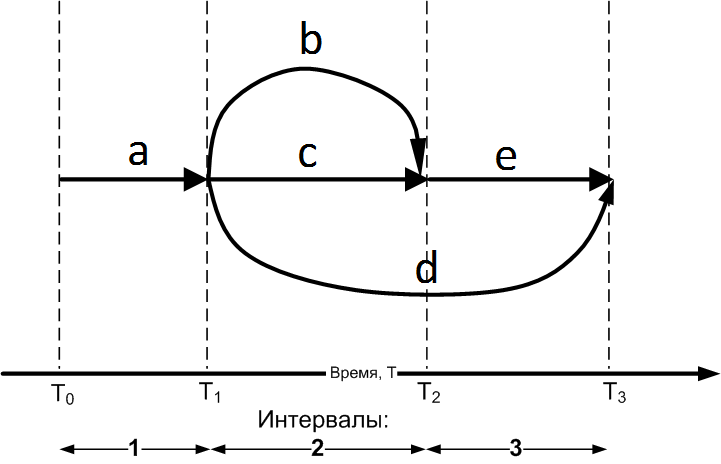
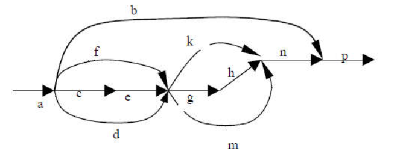
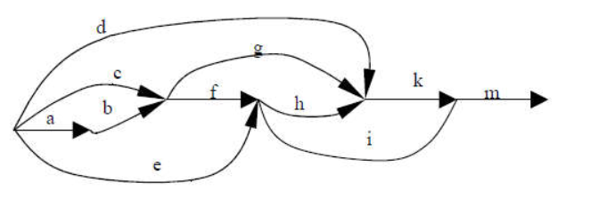
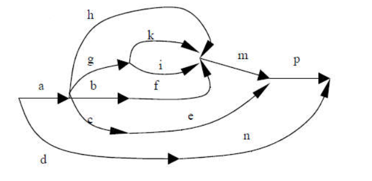

# OS #3. Developing a multi-threaded application using POSIX on Linux or Mac OS
## Objective of the work
Familiarity with multi-threaded programming and POSIX thread synchronization methods.

## Task
1. Using the task options table, select the thread launch graph in accordance with the option number. The vertices of the graph are the start/end points of the threads, the arcs denote the threads themselves. The length of the arc should be interpreted as an estimate of the flow's execution time. In the course of its work, each thread must perform two actions in a cycle: 
   1. output the letter of the thread name to the console;
   2. call the `computation()` function to perform calculations that require CPU usage for a long time. This function is already written and included from the header file `lab2.h`, you should not change it.
2. In accordance with the variant, select two groups on the graph with threads running in parallel. In the first group, the threads are not synchronized, the parallel execution of the threads included in the group occurs due to the task scheduler (see [examples](examples/README.md) [1](examples/README.md#Organization-of-parallel-execution-of-threads-without -use-synchronization-means) and [2](examples/README.md#Use-mutex-to-work-with-share-resource)). The second group is synchronized by semaphores and the threads within the group execute in a strictly fixed order: a member thread transfers control to another thread after each iteration of the loop (see [example 3](examples/README.md#Using-semaphores-to-thread-synchronize) and [producer and consumer problem](https://en.wikipedia.org/wiki/Producer%E2%80%93consumer_problem)). Thus, the threads in the second group are executed in strict order.
3. Using POSIX tools, implement a program for serial-parallel execution of threads in Linux or Mac OS X. It is forbidden to use any libraries and modules that solve the problem of cross-platform development of multi-threaded applications (std::thread, Qt Thread, Boost Thread, etc. .). To do this, write the code in the `lab2.cpp` file:
    1. The `unsigned int lab2_thread_graph_id()` function must return the number of the thread launch graph obtained from the job variants table.
    2. The `const char* lab2_unsynchronized_threads()` function must return a string consisting of the letters of threads executing in parallel without synchronization (see examples in files [lab2.cpp](lab2.cpp) and [lab2_ex.cpp](lab2_ex.cpp)) .
    3. The `const char* lab2_sequential_threads()` function must return a string consisting of letters of threads running in parallel in strict order one after another (see examples in files [lab2.cpp](lab2.cpp) and [lab2_ex.cpp](lab2_ex .cpp)).
    4. The `int lab2_init()` function replaces the `main()` function. In it, it is necessary to implement the launch of threads, the initialization of auxiliary variables (mutexes, semaphores, etc.). Before exiting the `lab2_init()` function, you need to make sure that all running threads have terminated. Return value: `0` - the function completed successfully, any other numeric value - a critical error occurred while executing the function.
    5. Add any other functions, variables and include files necessary for the program to work.
    6. You don't need to create a `main()` function. The project already has a ready-made `main()` function, it cannot be changed. It does one thing: it calls the `lab2_init()` function.
    7. You should not modify any files other than `lab2.cpp`. Also, do not create new files and write code in them, because the code from these files will not be used during testing.


Sequential execution of threads can be provided both through the use of semaphores and using the `pthread_join()` function. You can start threads all at once in the `lab2_init()` function, or one by one (or in groups) from other threads. The number of threads to start should be equal to the number of arcs in the graph plus one (for the main thread). It is forbidden to terminate the thread at the end of the interval and then start it again.

In the course of its work, each thread prints its letter to the console. Assessment of the correctness of the laboratory work is carried out as follows. If the streams **a** and **b** according to the graph must be executed simultaneously (in parallel), then the console must contain a sequence of the form **abababab** (or similar, for example, **aabbba**); if the threads are executed sequentially, then there is a sequence of the form **aaaaabbbbbb** in the console, and after the appearance of the first letter **b**, the letter **a** should no longer appear in the console. 

The number of letters output by each stream to the console should be proportional to the number of intervals (arc length) corresponding to the given stream on the graph. In this case, the number of characters output to the console by each of the threads must be no less than 3Q and no more than 5Q, where Q is the number of intervals on the graph during which the thread is executed. The multiplier in front of the Q value should be chosen the same for all streams, setting it to 3, 4, or 5. A stream is expected to print exactly Q characters to the console at each interval of its operation.

## An example of working with a flow graph
Consider the thread launch graph shown in the figure below.


A program that implements the thread launch sequence indicated on the graph must launch 5 threads: *a*, *b*, *c*, *d* and *e*. The work of the program can be divided into three time intervals:
1. From time T<sub>0</sub> to T<sub>1</sub>, only thread *a* is running.
2. From T<sub>1</sub> to T<sub>2</sub>, *b*, *c*, and *d* threads run in parallel.
3. From T<sub>2</sub> to T<sub>3</sub>, threads *d* and *e* work in parallel.

Let the threads *b*, *c* and *d* be executed in parallel without the use of synchronization tools, and the threads *d* and *e* should be executed in parallel in strict order one after the other due to the use of semaphores. In this case, the following variants of character sequences at the output of the program are possible:
```
aaabcdbcdbcdddedee
aaacdbcdbcdbedeedd
aaadcbdcbdcbeeddde
...
```

The file [lab2_ex.cpp](lab2_ex.cpp) contains an example of laboratory work for the considered graph. You can compile and run this example using a sequence of commands
```
g++ lab2_ex.cpp main.cpp -lpthread -o lab2_ex
./lab2_ex
```

## Building and testing
You can compile a program from the console without using a linker as follows. First, change to the directory containing the source files `lab2.h`, `lab2.cpp` and `main.cpp`. Further, all commands will be given relative to this directory.

Compiling the program to the file `a.out` in the current directory: 
```
g++ lab2.cpp main.cpp -lpthread
```
If you are using an older version of the GCC compiler, you may need to additionally specify the `-std=c++11` switch. In this case, the compiler will print the appropriate message to the console.

Running a compiled program: `./a.out`. If desired, you can specify the `-o` key when compiling, in which case you can specify a more meaningful name for the final file with the program than `a.out`. For example,
```
g++ lab2.cpp main.cpp -lpthread -o lab2
./lab2
```

### Tesing
To run tests on a local machine, you first need to build the [`gtest`](https://github.com/google/googletest) library. To do this, before the first compilation of tests, you must run the following sequence of commands:
```
cd test/gtest
GTEST_DIR=$(pwd)
g++ -isystem "${GTEST_DIR}"/include -I"${GTEST_DIR}" -pthread -c "${GTEST_DIR}"/src/gtest-all.cc 
ar -rv libgtest.a gtest-all.o
```
The text should appear in the console
```
ar: creating libgtest.a
a - gtest-all.o
```
You can also check with the `ls -l` command that the file `libgtest.a` has appeared in the current folder and its size is greater than zero bytes. If everything went well, you will no longer need to call these commands in the future.

Next, you need to return to the `test` directory located in the root directory of the repository. To compile tests, run the command 
```
g++ ../lab2.cpp tests.cpp -lpthread -lgtest -o runTests -I gtest/include -L gtest
``` 
If necessary, add the `-std=c++11` switch. You can run tests with the `./runTests` command. If not all tests completed successfully, you need to make changes to the `lab2.cpp` file, having achieved the correct execution of the task, then recompile the tests with the command `g++ ../lab2.cpp tests.cpp -lpthread -lgtest -o runTests -I gtest/ include -L gtest`, then restart the testing process. 

It is recommended to run the tests locally several times, even if they are successful, because the sequence of thread execution may differ from run to run of the program, and an error in solving the thread synchronization problem may not always appear. If the tests pass, you can run the `git add lab2.cpp`, `git commit` and `git push` commands, and then verify that the tests also passed successfully in the repository.

## Examples
It is recommended that you review the Thread Synchronization [examples](examples/README.md) before starting this lab. Also, a possible approach to doing the lab is shown in the file [lab2_ex.cpp](lab2_ex.cpp). In this example, threads b, c, and d are not synchronized, but threads d and e are synchronized by a pair of semaphores and are executed in strict sequence (interleaved) by analogy with the producer-consumer task.

The thread body can be implemented as a function that looks like this:
```
pthread_mutex_t lock;

void* thread_a_(void *ptr)
{
    for (int i = 0; i < 3; ++i) {
        pthread_mutex_lock(&lock);
        std::cout << "a" << std::flush;
        pthread_mutex_unlock(&lock);
        computation();
    }
    return ptr;
}
```
Here, the flow letter (_a_) is displayed three times, which corresponds to a graph arc with a length of one interval. The `std::flush` command is used to immediately print the stream letter to the console to avoid buffering at the operating system level. As an alternative solution, you can completely disable standard output buffering with the [`std::setbuf()`](https://en.cppreference.com/w/cpp/io/c/setbuf) function, like this: `std::setbuf(stdout, NULL)`.

After each letter is output to the console, the `computation()` function is necessarily called to simulate calculations and perform resource-intensive operations. In most cases, calling this function results in a context switch and another thread starts executing. This happens before the next letter is printed to the console by this thread.

Depending on the implementation of I/O operations in the operating system, as well as on the versions of the standard library and C/C++ compiler, a simple call to `std::cout << "a"` may or may not be an atomic operation. In any case, the command `std::cout << "a" << std::flush` is not atomic, since each `<<` statement is guaranteed to be a separate operation. Therefore, to avoid problems with output to the console, when working with a shared resource (standard output), a mutex is used. See the relevant [examples](examples/README.md) for details.

## Variants
| Variant number | Thread launch graph number | Intervals with unsynchronized threads | Interleaved intervals |
| ---:           |           ------:           |           ------:           |         ------:       |
|  1 |  5 | bceg | ghk |
|  2 |  6 | deg | bcd |
|  3 |  7 | dfgi | bcdg |
|  4 |  8 | deg | bce |
|  5 |  9 | fhi | bcd |
|  6 | 10 | dghi | bcde |
|  7 | 11 | bcde | deg |
|  8 | 12 | defg | ghi |
|  9 | 13 | cdef | him |
| 10 | 14 | cde | pkm |
| 11 | 15 | bcdgh | emn |
| 12 | 16 | bcef | ehi |
| 13 | 17 | bcd | fgh |
| 14 | 18 | bcdi | khi |
| 15 | 19 | dhikm | bcdf |
| 16 | 20 | bcf | gkmn |
| 17 |  1 | bcdf | bkgm |
| 18 |  2 | bcde | ikm |
| 19 |  3 | defh | bcd |
| 20 |  4 | bcde | efgh |
| 21 |  5 | cdfg | ikm |
| 22 |  6 | bcd | hik |
| 23 |  7 | bcdg | dfgi |
| 24 |  8 | bce | deg |
| 25 |  9 | bcd | fhi |
| 26 | 10 | bcde | dghi |
| 27 | 11 | deg | bcde |
| 28 | 12 | ghi | defg |
| 29 | 13 | him | cef |
| 30 | 14 | pkm | cde |

## Thread Launch Graphs

| Number | Thread Launch Graph |
|--------| --- |
| 1      |   |
| 2      |   |
| 3      |   |
| 4      |   |
| 5      |   |
| 6      |   |
| 7      |   |
| 8      |   |
| 9      |   |
| 10     |   |
| 11     |   |
| 12     |   |
| 13     |   |
| 14     |   |
| 15     |   |
| 16     |   |
| 17     |   |
| 18     |   |
| 19     |   |
| 20     |   |
