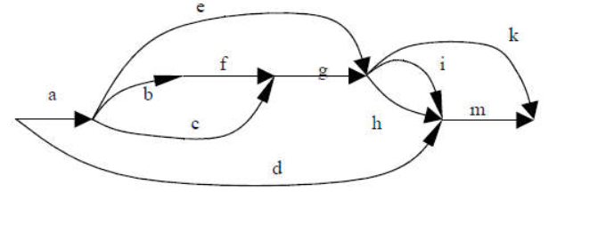
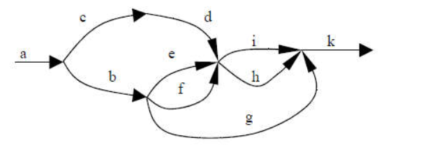
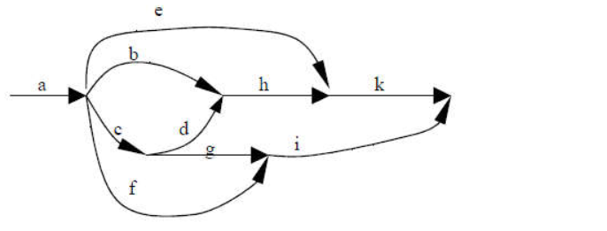
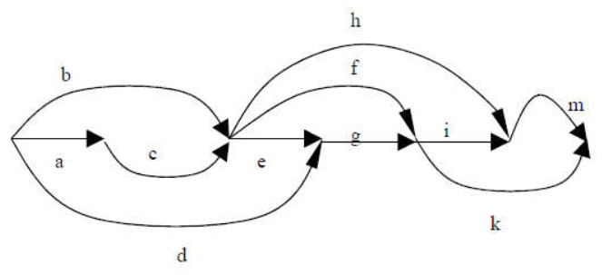
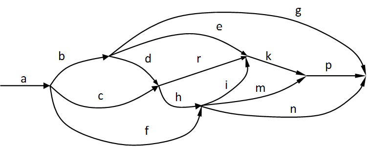

# OS #4. Developing a multi-threaded application in Windows OS
## Objective of the work
Familiarity with multi-threaded programming and methods for synchronizing threads using the Windows API.

## Task
1. Using the task options table, select the thread launch graph in accordance with the option number. The vertices of the graph are the start/end points of the threads, the arcs denote the threads themselves. The length of the arc should be interpreted as an estimate of the flow's execution time. In the course of its work, each thread must perform two actions in a cycle: 
   1. output the letter of the thread name to the console;
   2. call the `computation()` function to perform calculations that require CPU usage for a long time. This function is already written and included from the header file `lab3.h`, you should not change it.
2. In accordance with the variant, select two groups on the graph with threads running in parallel. In the first group, the threads are not synchronized, the parallel execution of the threads included in the group occurs at the expense of the task scheduler. The second group is synchronized by semaphores and the threads within the group execute in a strictly fixed order: the thread included in the group transfers control to another thread after each iteration of the loop (see [producer and consumer problem](https://en.wikipedia.org/wiki/Producer% E2%80%93consumer_problem)). Thus, the threads in the second group are executed in strict order.
3. Using the Windows API tools, implement a program for serial-parallel execution of threads in Windows OS. It is forbidden to use any libraries and modules that solve the problem of cross-platform development of multithreaded applications (std::thread, Qt Thread, Boost Thread, etc.). To do this, write the code in the `lab3.cpp` file:
    1. The `unsigned int lab3_thread_graph_id()` function must return the number of the thread launch graph obtained from the job variants table.
    2. The `const char* lab3_unsynchronized_threads()` function must return a string consisting of the letters of the threads executing in parallel without synchronization.
    3. The `const char* lab3_sequential_threads()` function must return a string consisting of the letters of the threads executing in parallel in strict order one after the other.
    4. The `int lab3_init()` function replaces the `main()` function. In it, it is necessary to implement the launch of threads, the initialization of auxiliary variables (mutexes, semaphores, etc.). Before exiting the `lab3_init()` function, you need to make sure that all running threads have terminated. Return value: `0` - the function completed successfully, any other numeric value - a critical error occurred while executing the function.
    5. Add any other functions, variables and include files necessary for the program to work.
    6. You don't need to create a `main()` function. The project already has a ready-made `main()` function, it cannot be changed. It does one thing: it calls the `lab3_init()` function.
    7. You should not modify any files other than `lab3.cpp`. Also, do not create new files and write code in them, because the code from these files will not be used during testing.


Sequential execution of threads can be provided both through the use of semaphores and using the `pthread_join()` function. You can start threads all at once in the `lab3_init()` function, or one by one (or in groups) from other threads.


In the course of its work, each thread prints its letter to the console. Assessment of the correctness of the laboratory work is carried out as follows. If the streams **a** and **b** according to the graph must be executed simultaneously (in parallel), then the console must contain a sequence of the form **abababab** (or similar, for example, **aabbba**); if the threads are executed sequentially, then there is a sequence of the form **aaaaabbbbbb** in the console, and after the appearance of the first letter **b**, the letter **a** should no longer appear in the console. 

The number of letters output by each stream to the console should be proportional to the number of intervals (arc length) corresponding to the given stream on the graph. In this case, the number of characters output to the console by each of the threads must be no less than 3Q and no more than 5Q, where Q is the number of intervals on the graph during which the thread is executed. The multiplier in front of the Q value should be chosen the same for all streams, setting it equal to 3, 4 or 5.


## An example of working with a flow graph
Consider the thread launch graph shown in the figure below.


A program that implements the thread launch sequence indicated on the graph must launch 5 threads: *a*, *b*, *c*, *d* and *e*. The program can be divided into three time intervals:
1. From time T<sub>0</sub> to T<sub>1</sub>, only thread *a* is running.
2. From T<sub>1</sub> to T<sub>2</sub>, *b*, *c*, and *d* threads run in parallel.
3. From T<sub>2</sub> to T<sub>3</sub>, threads *d* and *e* work in parallel.

Let the threads *b*, *c* and *d* be executed in parallel without the use of synchronization tools, and the threads *d* and *e* should be executed in parallel in strict order one after the other due to the use of semaphores. In this case, the following variants of character sequences at the output of the program are possible:
```
aaabcdbcdbcdddedee
aaacdbcdbcdbedeedd
aaadcbdcbdcbeeddde
...
```

## Bulding and testing
To build the code, it is recommended to create a project in any IDE, such as Visual Studio, CLion, Code::Blocks or similar. Tests are guaranteed to work when using the VC11 compiler (included with Visual Studio 2012) or later and the GCC compiler included with MinGW 5.0 or later.

It is recommended to run the tests locally several times, even if they are successful, because the sequence of thread execution may differ from run to run of the program, and an error in solving the thread synchronization problem may not always appear. If the tests pass, you can run the `git add lab3.cpp`, `git commit` and `git push` commands, and then verify that the tests also passed successfully in the repository.

## Variants
| Variant number | Thread launch graph number | Unsynchronized threads | Interleaved streams |
| ---:           |           ------:           |           ------:           |         ------:       |
|  1 |  1 | bcdf | bkgm |
|  2 |  2 | bcde | ikm |
|  3 |  3 | defh | bcd |
|  4 |  4 | bcde | efgh |
|  5 |  5 | bceg | ghk |
|  6 |  6 | deg | bcd |
|  7 |  7 | dfgi | bcdg |
|  8 |  8 | deg | bce |
|  9 |  9 | fhi | bcd |
| 10 | 10 | dghi | bcde |
| 11 | 11 | bcde | deg |
| 12 | 12 | defg | ghi |
| 13 | 13 | cdef | him |
| 14 | 14 | cde | pkm |
| 15 | 15 | bcdgh | emn |
| 16 | 16 | bcef | ehi |
| 17 | 17 | bcd | fgh |
| 18 | 18 | bcdi | khi |
| 19 | 19 | dhikm | bcdf |
| 20 | 20 | bcf | gkmn |
| 21 |  1 | bkhm | bdef |
| 22 |  2 | ikm | ihgfe |
| 23 |  3 | fgh | defh |
| 24 |  4 | efgh | degh |
| 25 |  5 | cdfg | ikm |
| 26 |  6 | bcd | hik |
| 27 |  7 | bcdg | dfgi |
| 28 |  8 | bce | deg |
| 29 |  9 | bcd | fhi |
| 30 | 10 | bcde | dghi |


## Options for thread launch graphs

| Number | Thread Launch Graph |
|--------| --- |
| 1      |   |
| 2      |   |
| 3      |   |
| 4      |   |
| 5      |   |
| 6      |   |
| 7      |   |
| 8      |   |
| 9      |   |
| 10     |   |
| 11     |   |
| 12     |   |
| 13     |   |
| 14     |   |
| 15     |   |
| 16     |   |
| 17     |   |
| 18     |   |
| 19     |   |
| 20     |   |
